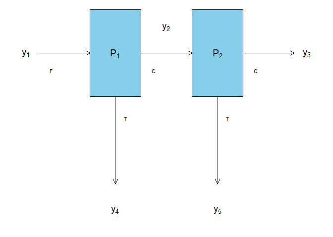

<!-- README.md is generated from README.Rmd. Please edit that file -->

# BayesMassBal

<!-- badges: start -->

[](https://travis-ci.org/skoermer/BayesMassBal)
[](https://ci.appveyor.com/project/skoermer/BayesMassBal)
[](https://codecov.io/gh/skoermer/BayesMassBal?branch=master)
<!-- badges: end -->

The goal of BayesMassBal is to allow users to do Bayesian data
reconciliation for a linearly constrained chemical or particulate
process at steady state.

## Installation

You can install the released version of BayesMassBal from
[CRAN](https://CRAN.R-project.org) with:

``` r
install.packages("BayesMassBal")
```

## Example

This is a basic example which shows you how to solve a common problem:

``` r
library(BayesMassBal)
```

Seven data sets are simulated for the following two node, two component,
process.



The constraints around these process nodes are:

  
  

and

  
  

Therefore the matrix of constraints, `C` is:

``` r
C <- matrix(c(1,-1,0,-1,0,0,1,-1,0,-1), nrow = 2, ncol = 5, byrow = TRUE)
C
#>      [,1] [,2] [,3] [,4] [,5]
#> [1,]    1   -1    0   -1    0
#> [2,]    0    1   -1    0   -1
```

The `constrain.process` function in the `BayesMassBal` package is used
to generate an `X` matrix based on `C` that will later be used with the
`bayes.massbal` function.

``` r
X <- constrain.process(C = C)
X
#>      [,1] [,2] [,3]
#> [1,]    1    1    1
#> [2,]    1    0    1
#> [3,]    1    0    0
#> [4,]    0    1    0
#> [5,]    0    0    1
```

Code for the data simulation creates a normally distributed feed rate,
process variability at each node drawn from independent beta
distributions, and *assay noise* on top of each observed mass.

``` r
f.rate <- 100
recCu <- c(98,95)/100
recG <- c(7,4)/100
g.cu <- 1.2/100
g.gangue <- 1-g.cu
tests <- 7

sd.feed <- 5
feed.mass <- rnorm(tests,mean = f.rate, sd = sd.feed)
true.cu <- true.gangue <- data.frame(matrix(NA, ncol = 5, nrow = tests))
names(true.cu) <- names(true.gangue) <- paste("B",1:5, sep = "")

v.cu <- c(0.00005,0.00008)
v.g <- c(0.00005,0.000025)

rec.cu.params <- list()
rec.cu.params[["r1"]]$alpha <- -(recCu[1]*(v.cu[1] + recCu[1]^2 - recCu[1])/v.cu[1])
rec.cu.params[["r1"]]$beta <- (v.cu[1]^2 + recCu[1]^2 - recCu[1])*(recCu[1]-1)/v.cu[1]
rec.cu.params[["r2"]]$alpha <- -(recCu[2]*(v.cu[2] + recCu[2]^2 - recCu[2])/v.cu[2])
rec.cu.params[["r2"]]$beta <- (v.cu[2]^2 + recCu[2]^2 - recCu[2])*(recCu[2]-1)/v.cu[2]

rec.g.params <- list()
rec.g.params[["r1"]]$alpha <- -(recG[1]*(v.g[1] + recG[1]^2 - recG[1])/v.g[1])
rec.g.params[["r1"]]$beta <- (v.g[1]^2 + recG[1]^2 - recG[1])*(recG[1]-1)/v.g[1]
rec.g.params[["r2"]]$alpha <- -(recG[2]*(v.g[2] + recG[2]^2 - recG[2])/v.g[2])
rec.g.params[["r2"]]$beta <- (v.g[2]^2 + recG[2]^2 - recG[2])*(recG[2]-1)/v.g[2]

r1.cu <- rbeta(n = tests, shape1 = rec.cu.params$r1$alpha, shape2 = rec.cu.params$r1$beta)
r2.cu <- rbeta(n = tests, shape1 = rec.cu.params$r2$alpha, shape2 = rec.cu.params$r2$beta)

r1.g <- rbeta(n = tests, shape1 = rec.g.params$r1$alpha, shape2 = rec.g.params$r1$beta)
r2.g <- rbeta(n = tests, shape1 = rec.g.params$r2$alpha, shape2 = rec.g.params$r2$beta)

true.cu$B1 <- feed.mass*g.cu
true.gangue$B1 <- feed.mass - true.cu$B1
true.cu$B2 <- true.cu$B1 * r1.cu
true.cu$B3 <- true.cu$B2 * r2.cu
true.cu$B4 <- true.cu$B1 * (1-r1.cu)
true.cu$B5 <- true.cu$B2 * (1-r2.cu)

true.gangue$B2 <- true.gangue$B1 * r1.g
true.gangue$B3 <- true.gangue$B2 * r2.g
true.gangue$B4 <- true.gangue$B1 * (1-r1.g)
true.gangue$B5 <- true.gangue$B2 * (1-r2.g)

true.total <- true.cu + true.gangue

noise <- function(X,s){
  out <- rnorm(n = length(X),mean = X, sd = s)
  return(out)
}

s <- c(0.15,0.2,0.05,0.00005,0.005)

obs.cu <- t(apply(true.cu,1,noise, s = s))

s <- c(5,1, 0.03, 2, 0.5)
obs.gangue<- t(apply(true.gangue,1,noise, s = s))
```

The observed masses are organized into a named list. Naming the sample
components can be helpful for inspecting the function output.:

``` r
y <- list(CuFeS2 = t(obs.cu), gangue = t(obs.gangue))
y
#> $CuFeS2
#>            [,1]       [,2]       [,3]       [,4]       [,5]       [,6]
#> [1,] 1.34157705 1.09476848 1.05256856 0.90237637 1.50206171 1.36928817
#> [2,] 1.02256897 1.00063760 1.29371798 0.57854905 0.78489527 1.39545563
#> [3,] 1.11628793 1.10028938 1.10164988 1.06805761 1.13306213 1.11248869
#> [4,] 0.02652378 0.02654932 0.02068781 0.02183104 0.03160986 0.02840639
#> [5,] 0.06301158 0.07312040 0.04518271 0.06081408 0.05479374 0.05533716
#>            [,7]
#> [1,] 1.17602419
#> [2,] 1.09939114
#> [3,] 1.13039555
#> [4,] 0.03631396
#> [5,] 0.07142238
#> 
#> $gangue
#>             [,1]        [,2]       [,3]       [,4]       [,5]        [,6]
#> [1,] 106.0686896 116.9720644 96.8414812 90.6188938 91.9875985 102.7295302
#> [2,]   6.1181243   7.3638082  6.9317324  7.4140061  6.1914507   7.0341198
#> [3,]   0.2423133   0.1979175  0.2002056  0.3553679  0.3020056   0.2581058
#> [4,]  99.5528611  93.6639456 87.9289057 87.3211762 94.8350110  93.6828330
#> [5,]   7.5138232   5.1909520  6.1034508  6.9697409  6.8862417   7.1547372
#>             [,7]
#> [1,] 107.5161936
#> [2,]   6.6679895
#> [3,]   0.1765374
#> [4,]  95.2548839
#> [5,]   6.1170939
```

More typically, the `massbal.data()` function can be used to import data
collected in the field and collated into a .csv. `massbal.data()` also
organizes user collected data for use with the `bayes.massbal()`
function.

Then, the `bayes.massbal` function is used to generate the distribution
of constrained masses from the data with `cov.structure = "indep"`.

``` r
indep.samples <- bayes.massbal(X = X, y = y, cov.structure = "indep", BIT = c(100,3000,1), lml = TRUE)
```

To obtain draws from the distribution of mass at each sample location,
in the same format as is seen in `y`, the draws of `beta` are simply
multiplied by `X`.

``` r
X.g <- X
y.bal <- lapply(indep.samples$beta,function(X,C = X.g){C %*% X})
```

There are many uses for these samples, including plotting the
probability distribution of the feed rate:

``` r
feed.rate <- y.bal$CuFeS2[1,] + y.bal$gangue[1,]
expected.feed <- mean(feed.rate)

d.feed <- density(feed.rate)
plot(d.feed, main = "Distribution of Feed Rate", xlab = "TPH", yaxt = "n", ylab = "")
abline(v = expected.feed, col ="red")
```


However, this may not be the best fitting model. Models specifying
covariance between sample locations for a single component, and
covariance between components at a single location are fit.

``` r
component.samples <- bayes.massbal(X = X, y = y, cov.structure = "component", BIT = c(100,3000,1), lml = TRUE)
```

``` r
location.samples <- bayes.massbal(X = X, y = y, cov.structure = "location", BIT = c(100,3000,1), lml = TRUE)
```

Computing ") for /p(y|\\texttt{component})"):

``` r
indep.samples$lml - component.samples$lml
#> [1] -135.2769
```

Then comparing
") to
")

``` r
component.samples$lml - location.samples$lml
#> [1] 1.610414
```
