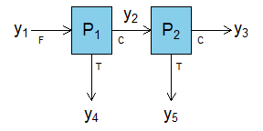
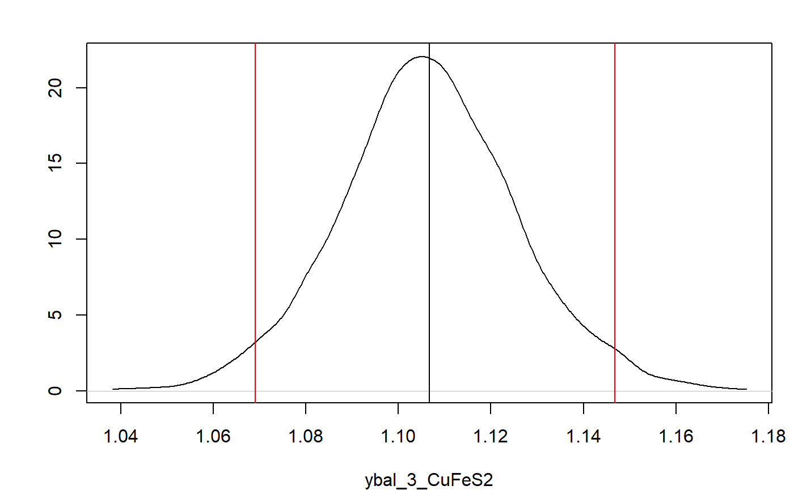
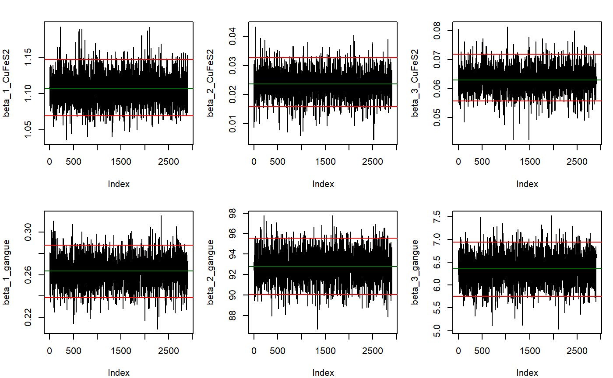

<!-- README.md is generated from README.Rmd. Please edit that file -->

# BayesMassBal

<!-- badges: start -->

[](https://travis-ci.org/skoermer/BayesMassBal)
[](https://ci.appveyor.com/project/skoermer/BayesMassBal)
[](https://codecov.io/gh/skoermer/BayesMassBal?branch=master)
<!-- badges: end -->

The goal of BayesMassBal is to allow users to easily conduct Bayesian
data reconciliation for a linearly constrained chemical or particulate
process at steady state.

Samples taken from a chemical process are always observed with noise.
Using data reconsciliation, or mass balance methods, to filter the noise
aided by a conscervation of mass constraint is common in chemical
engineering and minining engineering applications.

Typically, a mass balance produces point estimates of true mass flow
rates. However, using Bayesian methods one can get a better
understanding of process uncertainty to aid in decision making. The
`BayesMassBal` package provides functions allowing the user to easily
specify conscervation of mass constraints, organize collected data,
conduct a Bayesian mass balance using various error structures, and
select the best model for their data using Bayes Factors.

The Bayeisn mass balance uses MCMC methods to obtain samples of the
constrained masses. A publication detailing these methods is
forthcoming.

## Installation

You can install the released version of BayesMassBal from
[CRAN](https://CRAN.R-project.org) with:

``` r
install.packages("BayesMassBal")
```

## Example

This is a basic example which shows you how to solve a common problem:

``` r
library(BayesMassBal)
```

The function `BMB` is used with a two node process and simulated data.



The constraints around these process nodes are:

Therefore the matrix of constraints, `C` is:

``` r
C <- matrix(c(1,-1,0,-1,0,0,1,-1,0,-1), nrow = 2, ncol = 5, byrow = TRUE)
C
#>      [,1] [,2] [,3] [,4] [,5]
#> [1,]    1   -1    0   -1    0
#> [2,]    0    1   -1    0   -1
```

The `constrain.process` function in the `BayesMassBal` package is used
to generate an `X` matrix based on `C` that will later be used with the
`BMB` function.

``` r
X <- constrain.process(C = C)
X
#>      [,1] [,2] [,3]
#> [1,]    1    1    1
#> [2,]    1    0    1
#> [3,]    1    0    0
#> [4,]    0    1    0
#> [5,]    0    0    1
```

The previously simulated data is loaded from a `.csv` file using the
`massbal.data()` function.

``` r
y <- massbal.data(file = system.file("extdata", "twonode_example.csv",
                                  package = "BayesMassBal"),
                  header = TRUE, csv.params = list(sep = ";"))
```

Then, the `BMB` function is used to generate the distribution of
constrained masses from the data with `cov.structure = "indep"`.

``` r
indep.samples <- BMB(X = X, y = y, cov.structure = "indep", BTE = c(100,3000,1), lml = TRUE, verb = 0)
```

The output of `BMB` is a `BayesMassBal` object. Special instructions are
designated when feeding a `BayesMassBal` object to the `plot()`
function. Adding the argument `layout = "dens"` and indicating the mass
balanced flow rate for CuFeS2 at
 should be
plotted, by using a list supplied to `sample.params`, the desired
distribution can be plotted with the 95% HPDI.

``` r

plot(indep.samples,sample.params = list(ybal = list(CuFeS2 = 3)),
    layout = "dens",hdi.params = c(1,0.95))
```



It is also possible to generate trace plots to inspect convergence of
the Gibbs sampler. Here are trace plots for


``` r
plot(indep.samples,sample.params = list(beta = list(CuFeS2 = 1:3, gangue = 1:3)),layout = "trace",hdi.params = c(1,0.95))
```



The model with independent variances may not be the best fitting model.
Models specifying covariance between sample locations for a single
component, and covariance between components at a single location are
fit.

``` r
component.samples <- BMB(X = X, y = y, cov.structure = "component", BTE = c(100,3000,1), lml = TRUE, verb = 0)
```

``` r
location.samples <- BMB(X = X, y = y, cov.structure = "location", BTE = c(100,3000,1), lml = TRUE, verb = 0)
```

Computing ") for /p(y|\\texttt{component})"):

``` r
indep.samples$lml - component.samples$lml
#> [1] -138.6937
```

Then comparing
") to
")

``` r
component.samples$lml - location.samples$lml
#> [1] 0.8201977
```

The main effect of a variable independent of the process can be
calculated by supplying a function, `fn` that takes the arguments of
mass balanced flow rates `ybal`, and therandom independent and uniformly
distributed variables `x`. Information can be gained on the main effect
of a particular element of `x`, `xj`, on `fn` using the `mainEff`
function. Output from `mainEff` inlcudes information on the distribution
of |x_j \\rbrack").

``` r
fn_example <- function(X,ybal){
      cu.frac <- 63.546/183.5
      feed.mass <- ybal$CuFeS2[1] + ybal$gangue[1]
      # Concentrate mass per ton feed
      con.mass <- (ybal$CuFeS2[3] + ybal$gangue[3])/feed.mass
      # Copper mass per ton feed
      cu.mass <- (ybal$CuFeS2[3]*cu.frac)/feed.mass
      gam <- c(-1,-1/feed.mass,cu.mass,-con.mass,-cu.mass,-con.mass)
      f <- X %*% gam
      return(f)
      }

rangex <- matrix(c(4.00 ,6.25,1125,1875,3880,9080,20,60,96,208,20.0,62.5),
                   ncol = 6, nrow = 2)
mE_example <- mainEff(indep.samples, fn = "fn_example",rangex =  rangex,xj = 3, N = 25, res = 25)
```

A plot of the output can be made. To get lines that are better
connected, change increase `N` in the `mainEff` function.

``` r
m.sens<- mE_example$fn.out[2,]
hpd.sens <- mE_example$fn.out[c(1,3),]
row.names(hpd.sens) <- c("upper", "lower")
g.plot <- mE_example$g/2000

y.lim <- range(hpd.sens)

lzero.bound <- apply(hpd.sens,1,function(X){which(X <= 0)})
lzero.mean <- which(m.sens <= 0)

main.grid <- pretty(g.plot)
minor.grid <- pretty(g.plot,25)
minor.grid <- minor.grid[-which(minor.grid %in% main.grid)]

y.main <- pretty(hpd.sens)

par(mar = c(4.2,4,1,1))
plot(g.plot,m.sens, type = "n", xlim = range(g.plot), ylim = y.lim, ylab = "Net Revenue ($/ton Feed)", xlab=  "Cu Price ($/lb)")

abline(v = main.grid, lty = 6, col = "grey", lwd = 1)
abline(v = minor.grid, lty =3, col = "grey", lwd = 0.75)

abline(h = 0, col = "red", lwd = 1, lty = 6)

lines(g.plot[lzero.mean],m.sens[lzero.mean],col = "red", lwd =2)
lines(g.plot[-lzero.mean[-length(lzero.mean)]],m.sens[-lzero.mean[-length(lzero.mean)]],col = "darkgreen", lwd =2)

lines(g.plot[lzero.bound$lower],hpd.sens[2,][lzero.bound$lower], lty = 5, lwd = 2, col = "red")
lines(g.plot[-lzero.bound$lower],hpd.sens[2,][-lzero.bound$lower], lty = 5, lwd = 2, col = "darkgreen")

lines(g.plot[lzero.bound$upper],hpd.sens[1,][lzero.bound$upper], lty = 5, lwd = 2, col = "red")
lines(g.plot[-lzero.bound$upper],hpd.sens[1,][-lzero.bound$upper], lty = 5, lwd = 2, col= "darkgreen")

legend("topleft", legend = c("Expected Main Effect", "95% Bounds", "Net Revenue < $0", "Net Revenue > $0"), col = c("black","black","red", "darkgreen"), lty = c(1,6,1,1), lwd = c(2,2,2,2), bg = "white")
```


